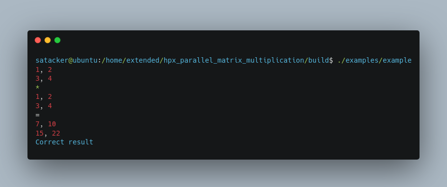
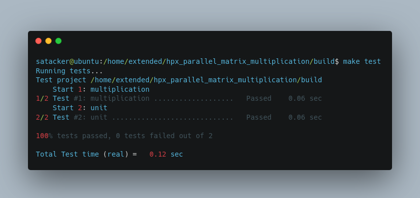

# hpx_parallel_matrix_multiplication

- Dependencies: 
    - HPX

### Instructions

```bash
git clone git@github.com:SAtacker/hpx_parallel_matrix_multiplication.git
cd hpx_parallel_matrix_multiplication
mkdir build
cd build
cmake .. DHPX_DIR=/home/extended/libs/lib/cmake/HPX -DCMAKE_CXX_COMPILER=$(which clang++-12)
make -j
make test
```

<p align="center">
  
</p>

<p align="center">
  
</p>